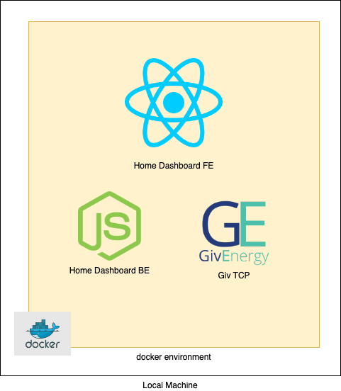
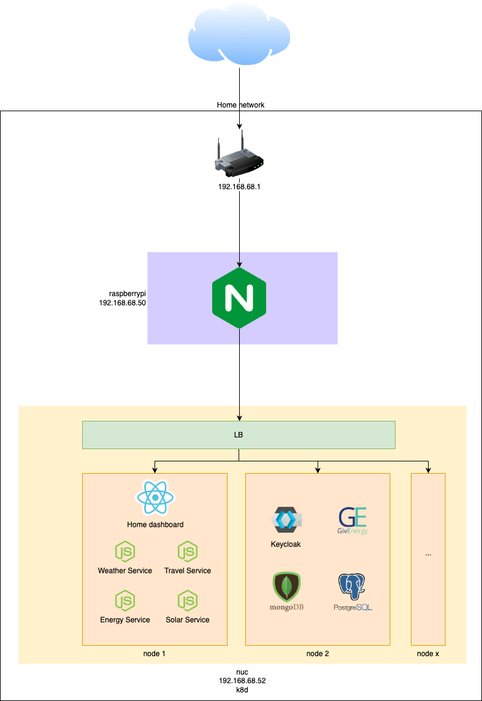

# Home Dashboard Infra

Infra related code for the home dashboard project

### Overview




This project contains code to run the project both locally and on the raspberrypi, the intent is to get the user up 
and running as fast as possible by using docker compose and the latest pre build containers for all the services. 
If you are working on the FE, you'll need to comment out the `home-dashboard-fe` portion of the compose file or the 
`home-dashboard-be` if your working on the backend.

In either case, you will need to fill in the following env vars for `home-dashboard-be` before running `docker-compose up`

```
OCTOPUS_API_KEY: sk_live_x
TFL_API_KEY: x
OCTOPUS_ACCOUNT_NUMBER: x
```

## The intended destination

Eventually, the application will be deployed differently to the way it is now. The intent is to have it deployed to a 
kubernetes system like follows




- `docker run --name some-nginx -v /some/content:/usr/share/nginx/html:ro -d nginx`
- `docker run --name my-custom-nginx-container -v ~/home-dashboard-infra/nginx/nginx.conf:/etc/nginx/nginx.conf:ro -v ~/home-dashboard-infra/nginx/conf.d/default.conf:/etc/nginx/conf.d/default.conf -d -p 80:80--add-host=host.docker.internal:host-gateway nginx`
- `docker run --name my-custom-nginx-container -v ~/home-dashboard-infra/nginx/nginx.conf:/etc/nginx/nginx.conf:ro -v ~/home-dashboard-infra/nginx/conf.d/default.conf:/etc/nginx/conf.d/default.conf -v ~/home-dashboard-fe/build:/usr/share/nginx/html/home-dashboard -d -p 80:80 --add-host=host.docker.internal:host-gateway nginx`

### Production (WIP)

For a production like environment, we'll be using k3s. It's a production like wrapper over the k8s distribution of k3s.

#### Prerequisites
- k3d installed
- helm installed
- helmfile installed

- To setup a 3 node cluster that accepts traffic on port 8081 run the following:
`k3d cluster create home-dashboard-cluster --api-port 6550 -p "8081:80@loadbalancer" --agents 2` or 
`k3d cluster create home-dashboard-cluster --api-port 6550 -p "80:80@loadbalancer" -p "443:443@loadbalancer" --agents 3` for a more production like one

- Then create an ingress that will route external traffic to certain services
`kubectl apply -f ./k3d/ingress.yaml`

- You may need to setup helm with a number of plugins, helmfile used to have a 'init' option that would do that for you but has seem to be removed, so do it manually in helm with the following (https://helm.sh/docs/community/related/#:~:text=Helm%20Plugins,testing%20plugin%20for%20Helm%20charts.&text=helm%2Drelease%2Dplugin%20%2D%20Plugin,releases%2C%20set%20helm%20release%20TTL.)
- install helm-diff with `helm plugin install https://github.com/databus23/helm-diff` (https://github.com/databus23/helm-diff)
- install helm secrets `helm plugin install https://github.com/jkroepke/helm-secrets` (https://github.com/jkroepke/helm-secrets?tab=readme-ov-file)
- 

- Deploy the example nginx service in the helmfile
`helmfile apply -f ./k3d/helmfile.yaml --no-color` (no-color as there seems to be a bug with the helmdiff app diffing with colours)

- In a browser, navigate to `localhost:8081` and you should see the nginx default page

k create configmap custom-index --from-file=./nginx-custom-values/custom-index.html